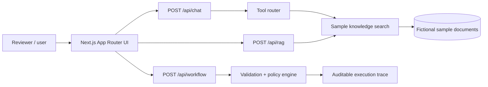

# AI Operations Studio

> Personal portfolio project / functional prototype — not a production system.

AI Operations Studio demonstrates how applied AI patterns can turn operational requests into clear, traceable outcomes. It is intentionally domain-neutral and uses only fictional, general-purpose sample content. It contains no employer, client, transaction, or confidential data.

## What the MVP demonstrates

1. **AI Chat + Tool Calling** — classifies a question, routes it to a local knowledge-search tool, and exposes the tool trace.
2. **RAG Knowledge Base** — retrieves relevant passages from three sample documents and returns a grounded answer with visible citations.
3. **Workflow Automation** — validates a fictional internal request, applies deterministic policy rules, routes exceptions, and prepares a mock notification.

The default `mock` mode is deterministic, free to run, and requires no credentials. This keeps the demo easy to review while making a clear distinction between implemented workflow logic and a future live-LLM integration.

## Architecture



### Design choices

- Route Handlers provide clear API boundaries for external clients or a future model provider.
- Interactive UI is isolated in a Client Component; the App Router page and layout remain Server Components.
- Retrieval and policy logic live in framework-independent TypeScript modules and have unit tests.
- Tool calls, sources, and workflow states are visible to support explainability and auditability.
- No database or model SDK is initialized at build time.

## Run locally

Requirements: Node.js 20.9 or newer and npm.

```bash
git clone <your-repository-url>
cd ai-operations-studio
npm install
copy .env.example .env.local
npm run dev
```

Open [http://localhost:3000](http://localhost:3000). On macOS/Linux, replace `copy` with `cp`.

## Quality checks

```bash
npm run lint
npm run typecheck
npm test
npm run build
```

## API examples

```bash
curl -X POST http://localhost:3000/api/rag \
  -H "Content-Type: application/json" \
  -d '{"query":"When should an expense claim be submitted?"}'
```

## Project structure

```text
src/
├── app/
│   ├── api/             # Chat, retrieval, and workflow endpoints
│   ├── globals.css      # Visual system and Tailwind entry point
│   └── page.tsx         # Server-rendered application entry
├── components/
│   └── studio.tsx       # Three interactive demo modules
└── lib/
    ├── knowledge.ts     # Sample documents and retrieval logic
    ├── workflow.ts      # Policy-based automation logic
    └── *.test.ts        # Unit tests
```

## Current scope and honest claims

This repository is a **personal portfolio prototype**. It demonstrates working UI, API boundaries, deterministic tool routing, lexical retrieval, source attribution, validation, and policy-based workflow orchestration. It does **not** claim production RAG, autonomous agents, model training, semantic vector search, enterprise security, or use with real customers.

## Roadmap

- Add an optional OpenAI-compatible provider behind the existing chat boundary.
- Replace lexical retrieval with chunking, embeddings, and a vector store; retain citations and add retrieval evaluation.
- Add file ingestion for safe sample PDF/Markdown documents.
- Persist workflow runs with authentication, role-based access, and an immutable audit log.
- Add integration tests, accessibility checks, request rate limits, and observability.

## Privacy and security

- Only mock/sample data is included.
- `.env*` is ignored; `.env.example` contains placeholders only.
- Never upload private documents, production credentials, or real personal/transaction data to this demo.

## License

MIT — see [LICENSE](LICENSE).
