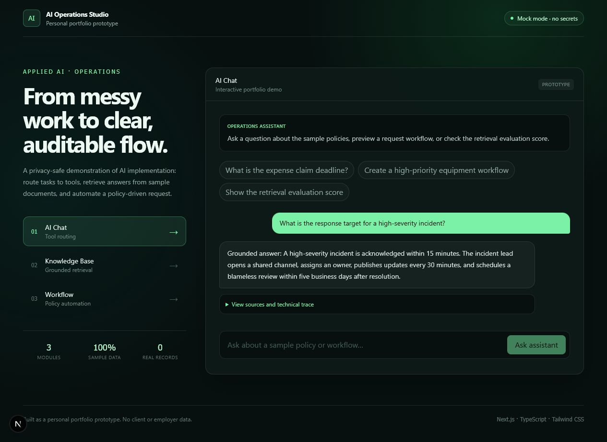
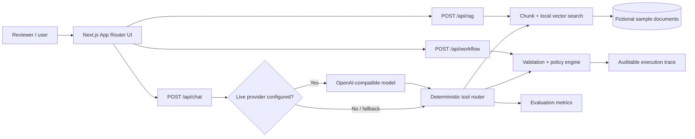

# AI Operations Studio

> Personal portfolio project / functional prototype — not a production system.

[](https://ai-operations-studio-black.vercel.app)
[](https://nextjs.org/)
[](#quality-checks)

**[Open the live demo →](https://ai-operations-studio-black.vercel.app)**



AI Operations Studio demonstrates how applied AI patterns can turn operational requests into clear, traceable outcomes. It is intentionally domain-neutral and uses only fictional, general-purpose sample content. It contains no employer, client, transaction, or confidential data.

## What the MVP demonstrates

1. **AI Chat + Multi-Tool Calling** — routes requests to knowledge search, workflow preview, or evaluation metrics and exposes every tool trace.
2. **RAG Knowledge Base** — chunks sample documents, creates deterministic local feature-hashing embeddings, ranks passages with cosine similarity, and returns grounded answers with visible citations.
3. **Workflow Automation** — validates a fictional internal request, applies deterministic policy rules, routes exceptions, and prepares a mock notification.

The default `mock` mode is deterministic, free to run, and requires no credentials. An optional OpenAI-compatible provider can perform model-driven tool selection behind the same API boundary. If the provider is unavailable, the route falls back safely to deterministic routing.

### Measured prototype quality

- 3/3 documented retrieval evaluation cases pass at top-1 on the intentionally small sample set.
- 9 unit tests cover retrieval, vector similarity, chunking, tool routing, evaluation, and workflow policy behavior.
- The evaluation result is exposed through `GET /api/evaluation` and displayed in the Knowledge Base interface.

These figures validate only the included fictional sample set; they are not claims of production accuracy.

## Portfolio case study

**Problem:** Operational AI demos often hide their decisions, depend on private data, or fail without a paid model key.

**Approach:** Build three small but complete flows behind explicit API boundaries. Keep retrieval, policy logic, tool traces, citations, and workflow states visible. Use fictional sample documents so any reviewer can run the project safely.

**Delivered:** A deployed, responsive Next.js application with three working modules, deterministic no-key demo mode, tested domain logic, production build validation, and automatic deployments from GitHub through Vercel.

**What I would measure next:** grounded-answer accuracy, retrieval precision, workflow completion rate, exception rate, time saved per request, and cost/latency after adding a live model provider.

## Architecture



### Design choices

- Route Handlers provide clear API boundaries for external clients or a future model provider.
- Interactive UI is isolated in a Client Component; the App Router page and layout remain Server Components.
- Retrieval, embedding adapter, evaluation, tools, and policy logic live in framework-independent TypeScript modules and have unit tests.
- Tool calls, sources, and workflow states are visible to support explainability and auditability.
- No database or model SDK is initialized at build time.

## Run locally

Requirements: Node.js 20.9 or newer and npm.

```bash
git clone <your-repository-url>
cd ai-operations-studio
npm install
copy .env.example .env.local
npm run dev
```

Open [http://localhost:3000](http://localhost:3000). On macOS/Linux, replace `copy` with `cp`.

### Optional live model mode

The public demo does not need or expose a secret. To test model-driven tool selection locally, set these values in `.env.local`:

```dotenv
AI_PROVIDER=openai
OPENAI_API_KEY=your_key_here
OPENAI_MODEL=gpt-4.1-mini
AI_BASE_URL=https://api.openai.com/v1
```

`AI_BASE_URL` can point to another provider that implements the OpenAI chat-completions and tool-calling contract. Never commit `.env.local`.

## Quality checks

```bash
npm run lint
npm run typecheck
npm test
npm run build
```

## API examples

```bash
curl -X POST http://localhost:3000/api/rag \
  -H "Content-Type: application/json" \
  -d '{"query":"When should an expense claim be submitted?"}'
```

## Project structure

```text
src/
├── app/
│   ├── api/             # Chat, retrieval, and workflow endpoints
│   ├── globals.css      # Visual system and Tailwind entry point
│   └── page.tsx         # Server-rendered application entry
├── components/
│   └── studio.tsx       # Three interactive demo modules
└── lib/
    ├── knowledge.ts     # Sample documents and retrieval logic
    ├── workflow.ts      # Policy-based automation logic
    └── *.test.ts        # Unit tests
```

## Current scope and honest claims

This repository is a **personal portfolio prototype**. It demonstrates working UI, API boundaries, multi-tool routing, local feature-hashing vector retrieval, chunking, cosine ranking, source attribution, evaluation, validation, and policy-based workflow orchestration. It does **not** claim production RAG, learned semantic embeddings, an autonomous multi-agent system, model training, enterprise security, or use with real customers.

## Roadmap

- Add provider-specific integration tests and streaming for the optional OpenAI-compatible mode.
- Replace the local feature-hashing embedding adapter with learned embeddings and a persisted vector database; expand the evaluation dataset.
- Add file ingestion for safe sample PDF/Markdown documents.
- Persist workflow runs with authentication, role-based access, and an immutable audit log.
- Add integration tests, accessibility checks, request rate limits, and observability.

## Privacy and security

- Only mock/sample data is included.
- `.env*` is ignored; `.env.example` contains placeholders only.
- Never upload private documents, production credentials, or real personal/transaction data to this demo.

## License

MIT — see [LICENSE](LICENSE).
