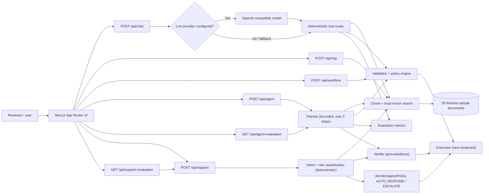
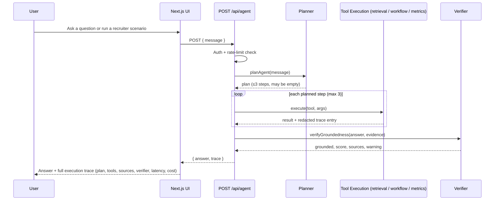
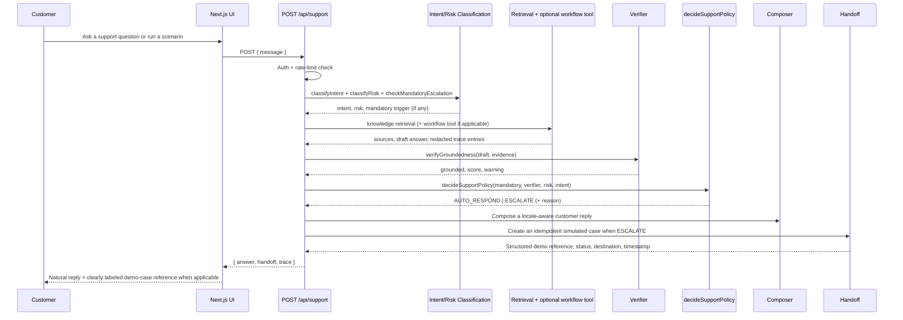

# AI Operations Studio — Agentic Online Gaming Support Copilot

> Personal portfolio project / functional prototype — not a production system. Bounded agent workflow, not an autonomous production agent. Not enterprise-grade RAG.

[](https://ai-operations-studio-black.vercel.app)
[](https://nextjs.org/)
[](#quality-checks)

**[Open the live demo →](https://ai-operations-studio-black.vercel.app)**

AI Operations Studio demonstrates how applied AI patterns can turn fictional online-gaming support requests into clear, traceable, safely escalated outcomes. The knowledge base covers promotions, deposits, withdrawals, game issues, and responsible-use support. It contains no real operator names, employer data, customer records, transactions, or confidential information.

## Reviewer quick start

1. Open the **[live demo](https://ai-operations-studio-black.vercel.app)** and enter the demo password supplied privately with the application.
2. In the default **Live Chat**, verify the fictional customer with `USER-RAY01`. The system creates a signed, 30-minute customer context before chat becomes available.
3. Run the promotion or game-issue scenario to see a natural response without internal AI terminology.
4. Run the missing-deposit or missing-withdrawal scenario to see a customer-scoped status lookup, safe reply, and simulated transaction-review reference.
5. Switch to **Internal AI Operations**, open Support Copilot, and expand **Technical execution trace** to inspect customer scope, intent, risk, retrieval sources, verifier result, tool calls, latency, and usage.
6. Review the [recruiter and technical-review guide](docs/reviewer-guide.md), [domain research QA](docs/domain-research-qa.md), [localization QA](docs/localization-qa.md), and [repository recovery QA](docs/repository-recovery-qa.md).

Estimated review time: **3–5 minutes for the guided demo; 15–20 minutes for the technical review.**

## Product positioning

**Designed to target up to 80-90% automation of repetitive, low-risk customer inquiries when supported by a sufficiently comprehensive, validated, and continuously maintained knowledge base.**

**This is a controlled-pilot target, not a guaranteed production result. Customer-support specialists remain responsible for complex, sensitive, exceptional, disputed, or high-risk cases.**

The consolidated AI Support Chat combines six pieces, each earning its place for a specific reason:

- **RAG** — grounds answers in an actual, inspectable document instead of the model's own memory.
- **A bounded agent** — an explicit, step-limited plan (classify → retrieve → optional tool → draft → verify → decide) instead of an open-ended loop, so cost and behavior stay predictable.
- **Deterministic policy rules** — intent, risk, and mandatory-escalation triggers are keyword-based, not model calls, so the safety-critical decisions are testable and explainable, not a black box.
- **A groundedness verifier** — checks the draft answer against retrieved evidence before it's allowed to auto-respond, instead of trusting the model's confidence.
- **Human escalation** — the explicit fallback whenever risk, evidence, or policy don't clearly support automation.
- **Evaluation and observability** — a fictional test dataset and a full execution trace turn "does this work" into a measurable, inspectable question instead of a demo-only claim.

## Product surfaces

- **Live Chat (default)** — a customer-facing simulation containing only conversation history, natural responses, common-question shortcuts, and a demo case reference when review is required. Internal intent, risk, RAG scores, decision labels, and execution traces are hidden.
- **Internal AI Operations** — a reviewer-facing workspace containing the Support AI monitor, Knowledge/RAG explorer, deterministic workflow automation, and bounded Agentic Copilot. This is where technical evidence and evaluation details remain inspectable.

This separation demonstrates that internal AI observability can remain available to operations and engineering teams without leaking implementation details into the customer experience.

### Simulated back-office status integration

Deposit and withdrawal questions use a shared simulated back-office adapter exposed through the protected `POST /api/support/status` route. Demo references include `DEP-1001`, `DEP-1002`, `WDL-2001`, `WDL-2002`, and `WDL-2003`.

- A normal `PENDING`, `PROCESSING`, or explained `REJECTED` status is returned directly without creating a case.
- If no reference is supplied, the assistant requests the minimum required reference first and does not create a case.
- A valid-looking unknown reference or a mismatch such as `COMPLETED` while the customer reports missing funds creates an idempotent simulated review case.
- Promotion and game questions that are grounded in the knowledge base are answered without a handoff.
- Customer-facing responses never request passwords, PINs, OTPs, or full bank-account details.

### Customer-scoped chat verification

Before Live Chat is enabled, the reviewer verifies a fictional User ID through `GET/POST/DELETE /api/support/customer`. The server stores the verified identity in a signed, HttpOnly, SameSite=Lax cookie with a 30-minute lifetime. Support and transaction-status routes reject requests without this customer context, and back-office records are filtered by their owner User ID before any status is returned. `USER-RAY01` owns the guided-scenario transactions; `USER-MALI02` is a second fictional account used to test cross-account isolation.

## What the MVP demonstrates

1. **AI Gaming Support Chat (Conversation → Tools → Evidence → Decision)** — the primary conversational surface handles fictional promotion, deposit, withdrawal, and game-support conversations with knowledge retrieval, multilingual response composition, simulated case handoff, and safe escalation.
2. **RAG Knowledge Base** — chunks sample documents, creates deterministic local feature-hashing embeddings, ranks passages with hybrid scoring, and returns grounded answers with visible citations.
3. **Workflow Automation** — validates a fictional internal request, applies deterministic policy rules, routes exceptions, and prepares a mock notification.
4. **Agentic Copilot (Planner → Tool Execution → Verifier)** — a bounded agent that plans up to 3 tool steps, executes them, and runs a groundedness verifier over the result. The full plan, tool inputs/outputs, retrieved sources, verifier result, latency, call counts, and provider usage (when available) are shown in the UI. See [Agent flow](#agent-flow).

The original `/api/chat` route remains available as a tested internal API capability, but the portfolio UI intentionally presents one consolidated conversational product: **AI Support Chat**.

The default `mock` mode is deterministic, free to run, and requires no credentials. An optional OpenAI-compatible provider can perform model-driven tool selection (chat) and semantic retrieval (RAG, agent, support) behind the same API boundary. If the provider is unavailable, every route falls back safely to deterministic behavior.

### Measured prototype quality

- 10/10 semantic retrieval cases pass at top-1 with `text-embedding-3-small`, including paraphrased questions and one negative/no-answer case (original 3-document Agentic Copilot dataset).
- 3/3 deterministic local-vector checks remain available as the no-key fallback baseline (same dataset).
- The following 35-case results are a **historical pre-hybrid baseline** on this repository's fictional data. They demonstrate the evaluation method, not the current checkpoint's live-provider performance; live metrics must be re-run after retrieval-policy changes:

  | Metric | Deterministic (no-key) | Live embeddings |
  |---|---|---|
  | Intent classification accuracy | 100% | 100% |
  | Risk classification accuracy | 100% | 100% |
  | Tool-routing accuracy | 100% | 100% |
  | Retrieval top-1 accuracy | 24% | 72% |
  | Groundedness accuracy | 48% | 76% |
  | No-answer detection | 80% | 80% |
  | Escalation precision / recall | 54% / 93% | 72% / 93% |
  | Response-format compliance | 100% | 100% |
  | Automation coverage (low-risk eligible cases) | 50% | 90% |
  | Mean latency | ~1ms | ~296ms |

  These numbers are not the 80-90% target — see [Knowledge-quality model](#knowledge-quality-model) for why, and [Evaluation methodology](#evaluation-methodology) for full definitions.
- Unit tests cover retrieval, vector similarity, chunking, tool routing, evaluation, workflow policy, agent planning/verification/redaction, multilingual conversation correction, response composition, intent/risk classification, signed customer context, cross-account isolation, simulated back-office lookup/handoff, and API auth — **181 tests**, see `npm test`.
- Results are exposed through `GET /api/evaluation`, `GET /api/agent-evaluation`, `GET /api/support-evaluation`, and displayed in the UI.

These figures validate only the included fictional sample set and documented thresholds; they are not claims of production accuracy.

## Portfolio case study

**Problem:** Operational AI demos often hide their decisions, depend on private data, fail without a paid model key, or let a "chat" answer sound confident even when nothing backs it up.

**Approach:** Build small but complete flows behind explicit API boundaries. Keep retrieval, policy logic, tool traces, citations, and workflow states visible. Add a bounded agent (plan → act → verify, max 3 tool steps, no open-ended loop) so multi-step reasoning stays inspectable instead of being a black box. Use fictional sample documents so any reviewer can run the project safely.

**Delivered:** A deployed, responsive Next.js application with four focused modules, a consolidated AI Support Chat, a deterministic no-key demo mode, a conservative lexical verifier, an extended evaluation suite, tested domain logic, production build validation, and automatic deployments from GitHub through Vercel.

**Measurable business value this pattern targets in a real deployment:**

| Metric | What it would tell an operations team |
|---|---|
| Grounded-answer rate | Share of answers backed by a real document, vs. unsupported claims caught before reaching a user |
| No-answer precision | Whether the system correctly says "I don't know" instead of guessing — directly reduces support escalations from wrong answers |
| Tool-routing accuracy | Whether requests reach the right automation path the first time, cutting manual triage |
| Workflow decision accuracy | Whether policy automation matches what a human reviewer would decide, a proxy for time saved per request |
| Latency and token/cost per request | What a rollout would cost and how it would feel to end users at scale |

**What I would measure next in production:** grounded-answer accuracy against a larger labeled set, retrieval precision/recall, workflow completion and exception rates, time saved per request vs. a manual baseline, and live cost/latency under real traffic.

## Architecture



### Design choices

- Route Handlers provide clear API boundaries for external clients or a future model provider.
- Interactive UI is isolated in a Client Component; the App Router page and layout remain Server Components.
- Retrieval, embedding adapter, evaluation, tools, policy logic, agent planning, and the verifier live in framework-independent TypeScript modules and have unit tests.
- Tool calls, sources, and workflow states are visible to support explainability and auditability.
- The agent planner is deterministic/rule-based rather than model-driven: it demonstrates the agentic pattern (explicit plan, bounded steps, visible trace, groundedness check) without the cost, latency, or unbounded-loop risk of letting a model decide when to stop. See [Agent flow](#agent-flow) for the trade-off discussion.
- No database or model SDK is initialized at build time.

## Agent flow

The Agentic Copilot module (`/api/agent`) runs a **bounded Planner → Tool Execution → Verifier** flow:

1. **Planner** (`src/lib/agent.ts`, `planAgent`) — a deterministic, keyword-based router decides which of up to 3 tools to use: knowledge retrieval, the workflow policy tool, and/or the evaluation/metrics tool. There is one plan slot per known tool, so the plan can never exceed `MAX_PLAN_STEPS = 3`, and there is no re-planning loop — the plan is computed once and executed once.
2. **Tool Execution** — each planned tool runs in order (semantic retrieval when a live provider is configured, otherwise the local deterministic path for every tool), and every call is recorded as a redacted trace entry (tool name, summarized input, summarized output, result count).
3. **Verifier** (`src/lib/verifier.ts`, `verifyGroundedness`) — checks both answer-to-evidence overlap and query-to-evidence support. The second gate prevents an unrelated retrieved chunk from validating itself merely because the answer copied that chunk. This remains a lexical heuristic, not entailment or proof of factual correctness. For workflow/metrics-only answers, the verifier reports `applicable: false`.
4. **Deterministic fallback** — if no tool matches, or a live provider call fails, the flow still returns a safe, explicit "could not confidently answer" response instead of erroring or hallucinating.



**Why bounded instead of autonomous:** an unbounded agent loop (the model deciding when to stop, re-planning indefinitely) is harder to test, harder to cost-control, and harder to explain to a non-technical stakeholder. This portfolio deliberately shows the more defensible engineering choice for most production use cases — explicit, inspectable, cost-capped steps — while being honest that it is not a general-purpose autonomous agent.

## RAG flow

1. Sample documents are chunked (`chunkText`) into short passages.
2. Each chunk is embedded — either with the deterministic local feature-hashing adapter (`embedText`, no key required) or, when a live provider is configured, with `text-embedding-3-small` via `createOpenAIEmbeddings`.
3. A query is embedded the same way and ranked against every chunk with cosine similarity.
4. The top result(s) above a relevance threshold become the answer's evidence; their document IDs, titles, and scores are returned as visible citations.
5. The agent's verifier re-checks the answer against that same evidence before it is shown as "grounded."

## Support agent flow

The Support Copilot module (`/api/support`, `src/lib/support-agent.ts`) extends the same bounded-agent pattern with customer-support-specific classification and policy:

```
customer message
  -> intent classification (deterministic, keyword-based — src/lib/support-classification.ts)
  -> risk classification (deterministic: LOW / MEDIUM / HIGH)
  -> knowledge retrieval (live embeddings when configured, else local vector fallback)
  -> optional support/workflow tool (only for request-status / account-onboarding-shaped intents)
  -> draft response (synthesized from retrieved evidence)
  -> groundedness verification (same verifier as the Agentic Copilot)
  -> mandatory-escalation + policy decision (deterministic, pure function: decideSupportPolicy)
  -> AUTO_RESPOND or ESCALATE (+ reason when escalating)
```

**Deterministic vs. model-driven, explicitly:** intent classification, risk classification, mandatory-escalation triggers, and the final AUTO_RESPOND/ESCALATE decision are all deterministic keyword/rule logic — none of them call a model. The only model-driven step is knowledge retrieval, which uses live embeddings when `OPENAI_API_KEY` is configured and otherwise falls back to the same local vector search as the rest of the app. This keeps every safety-relevant decision testable and explainable, and keeps a full deterministic fallback always available.

**Mandatory escalation** fires (regardless of retrieval) for: financial loss / transaction dispute, personal or sensitive-data requests, fraud/security/legal/compliance language, a request for an exception outside policy, and highly negative complaints or threats of public escalation. **Insufficient-evidence escalation** fires when the groundedness verifier cannot support the drafted answer. **High-risk escalation** fires whenever risk is classified HIGH, even if the answer would otherwise be grounded — this is the "escalate even though some relevant knowledge exists" case (see [recruiter scenario 7](#recruiter-scenarios)).



## Knowledge-quality model

Automation coverage is presented as a function of conditions, not a fixed number, because this repository's own measurements show why: retrieval quality alone moved the *same* decision logic from 50% automation coverage (deterministic local-vector retrieval) to 90% (live embeddings) on the identical 35-case dataset (see the table above). The conditions this repository documents (`automation-coverage-conditions` in the knowledge base, and enforced nowhere else — this is intentionally not a numeric formula) are:

- **Knowledge completeness** — every intent the system should auto-answer needs a document.
- **Document accuracy** — an out-of-date document produces a confidently-wrong grounded answer just as easily as a correct one.
- **Freshness** — policy changes (pricing, refund windows, exceptions) must reach the knowledge base before they reach customers.
- **Exception coverage** — undocumented edge cases are exactly where an automated answer is most likely to be wrong.
- **Retrieval quality** — measured directly in this repository: the same policy logic, same dataset, same threshold *type*, produced a 3x difference in automation coverage purely from retrieval method.
- **Escalation thresholds** — set too loose, unsafe answers get auto-sent; set too strict, coverage drops (also measured directly above).
- **Channel and language coverage** — this prototype only implements one web-chat demo UI in English; real coverage claims must specify which channels/languages they cover.
- **Continuous evaluation and maintenance** — a knowledge base and threshold that are correct today drift as products, policies, and phrasing change.

No numeric correlation beyond the two directly-measured data points above (50% vs. 90% coverage under two retrieval methods, same dataset) is claimed here.

## Evaluation methodology

Three endpoints expose evaluation results, all computed against the small, fictional, domain-neutral dataset in this repository — **figures describe behavior on this included dataset only, not a claim of accuracy on other data**:

- `GET /api/evaluation` — retrieval top-1 accuracy (`src/lib/evaluation.ts`), both the deterministic local-vector baseline and the optional live-embeddings mode.
- `GET /api/agent-evaluation` — the extended suite (`src/lib/agent-evaluation.ts`):
  - **Tool-routing accuracy** — does the planner pick the expected tool (or correctly pick none) for a labeled set of messages.
  - **Workflow decision accuracy** — does the policy engine's auto-approve/needs-review decision match the expected outcome for a labeled set of requests.
  - **Groundedness / no-answer detection** — does the verifier correctly mark on-topic questions as grounded and correctly mark out-of-scope questions as ungrounded (no-answer).
  - **Latency summary** — min/mean/max end-to-end latency across a fixed sample of agent runs.
- `GET /api/support-evaluation` — the Customer Support Copilot suite (`src/lib/support-evaluation.ts`), a 41-case fictional dataset: the original 35 general-support cases plus 6 online-gaming deposit, withdrawal, game, and promotion cases:
  - **Intent / risk classification accuracy** — deterministic classifier output vs. a labeled expected value.
  - **Retrieval top-1 accuracy** — top retrieved document ID vs. the labeled expected document, for cases where one exists.
  - **Groundedness accuracy** — share of answerable (normal/paraphrase) cases the verifier correctly marks grounded.
  - **No-answer detection** — share of the 5 insufficient-evidence cases the verifier correctly marks ungrounded.
  - **Tool-routing / workflow-decision accuracy** — whether the optional workflow tool ran exactly when the intent called for it.
  - **Escalation precision / recall** — of all cases the system escalated, how many should have been escalated (precision); of all cases that should have escalated, how many did (recall).
  - **Response-policy compliance** — does every response match the expected format for its decision (escalation phrasing present only when escalating).
  - **Automation coverage** — proportion of the dataset's LOW-risk, answerable cases safely handled by AUTO_RESPOND. Defined and measured only over this small fictional dataset; **not** presented as the 80-90% pilot target, and not extrapolated to real traffic.
  - **Latency summary** — min/mean/max across all 41 cases.

  Automated tests (`support-evaluation.test.ts`) assert 100% on the metrics that are structurally deterministic (intent, risk, tool-routing, response-format compliance) and assert real, non-perfect bounds — not fabricated 100%s — on the retrieval-dependent metrics, consistent with the measured table earlier in this README.

## Recruiter scenarios

The AI Gaming Support Chat tab has 8 one-click scenarios:

1. Deposit credit missing (ESCALATE, HIGH risk, simulated transaction-review case).
2. Withdrawal delayed (evidence-grounded status and next-step guidance).
3. Withdrawal completed but funds missing (ESCALATE, HIGH risk).
4. Game freeze and balance issue (troubleshooting plus safe evidence intake).
5. Welcome-promotion conditions (grounded answer with citations).
6. Bonus turnover blocking withdrawal (explain conditions without promising release).
7. Unknown gaming-account transaction (ESCALATE, HIGH risk).
8. Responsible-use concern (supportive control guidance without encouraging further spending).

The Agentic Copilot tab (the earlier, more general-purpose milestone) keeps its own 3 scenarios: a RAG policy question, a workflow analysis, and an insufficient-evidence case.

## Run locally

Requirements: Node.js 20.9 or newer and npm.

```bash
git clone <your-repository-url>
cd ai-operations-studio
npm install
copy .env.example .env.local
npm run dev
```

Open [http://localhost:3000](http://localhost:3000). On macOS/Linux, replace `copy` with `cp`.

Set `DEMO_PASSWORD` in `.env.local` before opening the app — you will be prompted for it at `/login`. See [Demo access](#demo-access-password-gate).

### Optional live model mode

The public demo does not need or expose a secret. To test model-driven tool selection locally, set these values in `.env.local`:

```dotenv
AI_PROVIDER=openai
OPENAI_API_KEY=your_key_here
OPENAI_MODEL=gpt-4.1-mini
AI_BASE_URL=https://api.openai.com/v1
```

`AI_BASE_URL` can point to another provider that implements the OpenAI chat-completions and tool-calling contract. Never commit `.env.local`.

## Demo access (password gate)

The demo is protected by a shared **demo password** so a public deployment is not left fully open. This is intentionally minimal: a single password, a signed session cookie, and per-client login-attempt limiting. It is **password-gated portfolio demo access, not production authentication** — there is no user database, account model, roles, or external identity provider.

Set the password locally before running:

```dotenv
DEMO_PASSWORD=change-me-demo-password
```

Behavior:

- Visiting any application page without a valid session redirects to `/login`.
- All AI API routes (`/api/chat`, `/api/rag`, `/api/workflow`, `/api/evaluation`, `/api/status`, `/api/agent`, `/api/agent-evaluation`, `/api/support`, `/api/support-evaluation`) independently return `401` without a valid session.
- A correct password issues a signed session cookie: `HttpOnly`, `Secure` in production, `SameSite=Lax`, `Path=/`, and a 24-hour expiry.
- After 5 failed attempts within 15 minutes, further attempts from that client are temporarily blocked (`429`).
- **Sign out** clears the session cookie and returns to `/login`.
- The password is read only from `DEMO_PASSWORD` and is never logged, printed, returned, or exposed in any response.

## Quality checks

```bash
npm run lint
npm run typecheck
npm test
npm run build
```

## API examples

```bash
curl -X POST http://localhost:3000/api/rag \
  -H "Content-Type: application/json" \
  -d '{"query":"When should an expense claim be submitted?"}'

curl -X POST http://localhost:3000/api/agent \
  -H "Content-Type: application/json" \
  -d '{"message":"When are expense claims due and what receipt is required for reimbursement?"}'

curl http://localhost:3000/api/agent-evaluation

curl -X POST http://localhost:3000/api/support \
  -H "Content-Type: application/json" \
  -d '{"message":"How do I create a new account?"}'

curl http://localhost:3000/api/support-evaluation
```

(All require a valid `demo_session` cookie from `/api/login` — see [Demo access](#demo-access-password-gate).)

## Project structure

```text
src/
├── app/
│   ├── api/             # Chat, retrieval, workflow, agent, support, and evaluation endpoints
│   ├── globals.css      # Visual system and Tailwind entry point
│   └── page.tsx         # Server-rendered application entry
├── components/
│   └── studio.tsx       # Five interactive demo modules, including both agent trace UIs
└── lib/
    ├── knowledge.ts              # Sample documents (26) and retrieval logic
    ├── workflow.ts                # Policy-based automation logic
    ├── agent.ts                   # Bounded Planner → Tool Execution → Verifier orchestrator
    ├── verifier.ts                # Groundedness scoring
    ├── trace-redaction.ts         # Secret-pattern redaction for anything shown in a trace
    ├── agent-evaluation.ts        # Agentic Copilot evaluation suite
    ├── support-classification.ts  # Deterministic intent/risk/mandatory-escalation logic
    ├── support-agent.ts           # Support Copilot orchestrator + decideSupportPolicy
    ├── support-evaluation.ts      # 41-case Customer Support Copilot evaluation suite
    └── *.test.ts                  # Unit and integration tests (181)
```

**Files an AI Engineer should inspect first:** `src/lib/support-agent.ts` (the orchestration flow and the pure `decideSupportPolicy` function), `src/lib/support-classification.ts` (deterministic policy logic), `src/lib/verifier.ts` (the groundedness heuristic and its documented limits), `src/lib/agent.ts` (the mode-aware retrieval threshold and why it exists), `src/lib/support-evaluation.ts` (how the honest, non-cherry-picked metrics table above was produced).

## Engineering approach

This project was built through an AI-assisted engineering workflow. I led the problem framing, requirements analysis, product direction, workflow and escalation rules, acceptance criteria, evaluation design, behavioral testing, and final review. AI coding tools accelerated implementation in areas where I am still developing deeper coding expertise.

I do not present this repository as evidence that I manually authored every line or independently implemented every low-level component from memory. It demonstrates how I translate an operational problem into a bounded AI system, direct implementation, challenge incorrect behavior with measured tests, document trade-offs, and retain responsibility for final engineering decisions and acceptance.

## Current scope and honest claims

This repository is a **personal portfolio prototype**. It demonstrates working UI, API boundaries, multi-tool routing, local feature-hashing vector retrieval, chunking, cosine ranking, source attribution, evaluation, validation, policy-based workflow orchestration, a bounded agent workflow with a groundedness verifier, and a customer-support-specific extension with deterministic intent/risk classification and mandatory-escalation policy.

It does **not** claim: production RAG, learned semantic embeddings at scale, an autonomous production agent (the planner is deterministic and bounded, not a model deciding its own stopping point), model training, enterprise security, or use with real customers. The retrieval layer uses lightweight hybrid ranking but has no persisted vector store or document access control. The groundedness verifier is a lexical heuristic, not an entailment model; it does not guarantee factual correctness. **80-90% automation is a stated pilot target, not a production result.** Historical live/local measurements in this README apply only to the included fictional dataset and must be re-measured after retrieval-policy changes.

### Implementation status

| Capability | Status |
|---|---|
| Intent classification, risk classification, mandatory-escalation rules | **IMPLEMENTED** (deterministic) |
| Knowledge retrieval with citations, groundedness verifier | **IMPLEMENTED** |
| AUTO_RESPOND / ESCALATE decision, redacted execution trace | **IMPLEMENTED** |
| Evaluation suite (routing, groundedness, escalation precision/recall, coverage, latency) | **IMPLEMENTED** |
| Workflow "status check" step for request-status/onboarding intents | **SIMULATED / MOCKED** — no real ticketing system |
| Support handoff adapter | **IMPLEMENTED AS A SIMULATION** — creates an idempotent in-memory demo case with a structured reference; no real employee or external system is notified |
| CRM, ticketing, email, web chat widget, LINE/Telegram/WhatsApp/Slack, Google Drive/Notion/SharePoint integration | **ROADMAP** — not present in this codebase |
| Persisted vector database, model-based (entailment) groundedness | **ROADMAP** |
| English/Thai/Chinese UI, input normalization, and response localization | **IMPLEMENTED** — live translation is provider-assisted; offline localization is intentionally limited |
| Role-based access and persisted audit log | **ROADMAP** |

## Interview talking points

- **Why a bounded agent instead of an autonomous one?** Cost, testability, and explainability. A fixed max-3-step plan with no re-planning loop can be fully unit-tested (see `agent.test.ts`, `support-agent.test.ts`) and has a hard ceiling on tool calls and (in live mode) provider spend — properties an open-ended agent loop does not have. I can explain this trade-off to a non-technical stakeholder in one sentence: "it always finishes, and you can always see why."
- **How do you keep an LLM feature from silently making things up?** Use conservative retrieval gates, require both query-to-evidence support and answer-to-evidence overlap, and escalate when either is weak. This is an explainable heuristic rather than an independent semantic fact checker; production use would require claim-level entailment evaluation and human review for risky cases.
- **How do you decide what a bot should never answer on its own?** Separate policy from retrieval: mandatory-escalation triggers (fraud, disputes, sensitive data, policy exceptions, angry complaints) are deterministic keyword rules checked independently of whether the answer would otherwise be grounded — a well-cited answer to a question that should never be automated still escalates (see recruiter scenario 7).
- **Why did retrieval accuracy matter so much here?** I measured it directly rather than assuming it: the exact same policy logic on the exact same 35-case dataset went from 50% to 90% automation coverage purely by swapping the retrieval method (deterministic hashing vs. live embeddings). That's the single clearest piece of evidence in this repo for why "knowledge quality/retrieval quality" is listed as a precondition for the 80-90% target, not a guarantee.
- **How would you extend this to a real team's documents?** Swap `embedText`/`searchKnowledge` for a managed embedding model and a persisted vector store (already isolated behind `knowledge.ts`), add document-level access control, and replace the lexical verifier with an entailment-model-based check — the Planner/Verifier/trace architecture does not need to change.
- **How do you show value to a non-engineering stakeholder?** The trace panel and evaluation suite are deliberately non-technical-readable: intent/risk → tools → sources → grounded/not-grounded → AUTO_RESPOND/ESCALATE → latency/cost, in one screen, so a hiring manager or ops lead can see *why* a decision was made without reading code.
- **What would you change before shipping this to real users?** See [Roadmap](#roadmap) and [Current scope and honest claims](#current-scope-and-honest-claims) — persisted vector store, real authentication, shared rate-limit store, model-based (not lexical) groundedness, a real human-agent queue, and a much larger labeled evaluation set validated against real traffic.

## Roadmap

- Add provider-specific integration tests and streaming for the optional OpenAI-compatible mode.
- Replace the local feature-hashing embedding adapter with learned embeddings and a persisted vector database; expand the evaluation dataset.
- Replace the lexical-overlap verifier with a model-based entailment check for stronger groundedness detection.
- Connect CRM, ticketing, email, web chat, and messaging channels (LINE, Telegram, WhatsApp, Slack) plus document sources (Google Drive, Notion, SharePoint) for a continuously synced knowledge base.
- Replace the simulated in-memory handoff adapter with an authenticated CRM/helpdesk queue and immutable audit log.
- Add multi-language intent/risk classification and role-based access for support supervisors.
- Add file ingestion for safe sample PDF/Markdown documents.
- Persist workflow runs with authentication, role-based access, and an immutable audit log.
- Add integration tests, accessibility checks, and observability (structured tracing/metrics export) for both agent flows.

## Privacy and security

- Only mock/sample data is included.
- Demo access is gated by a shared `DEMO_PASSWORD`; the value is read only from the environment and never committed, logged, or returned. This is a portfolio gate, not production authentication.
- `.env*` is ignored; `.env.example` contains placeholders only.
- Public AI endpoints (including `/api/agent`, `/api/agent-evaluation`, `/api/support`, and `/api/support-evaluation`) apply per-client request limits, 500-character input limits, provider timeouts, and a 350-token chat output cap as basic cost guards. Both agent planners additionally cap every request to at most 2-3 tool calls.
- The execution trace shown in the UI is built only from a fixed set of safe, summarized fields (plan/intent/risk, tool name, summarized input/output, sources, verifier result, decision + escalation reason, latency, call counts, token usage) — it never includes prompts, hidden system instructions, secrets, API keys, passwords, or cookies. As defense in depth, any text derived from user input or tool output that lands in a trace field is also passed through a secret-pattern redactor (`trace-redaction.ts`) before being returned; this is tested directly (`auth-flow.test.ts`, `support-agent.test.ts`) by embedding a fake secret pattern in a request and asserting it never appears in the response.
- An ESCALATE decision creates a **simulated** in-memory support case and structured demo reference. No real employee, CRM, or external ticketing platform is notified (see [Implementation status](#implementation-status)).
- Never upload private documents, production credentials, or real personal/transaction data to this demo.

The in-memory request limiter is appropriate only as a lightweight portfolio guard. A production deployment should use a shared rate-limit store, authentication, quotas, abuse monitoring, and budget alerts.

## License

MIT — see [LICENSE](LICENSE).
